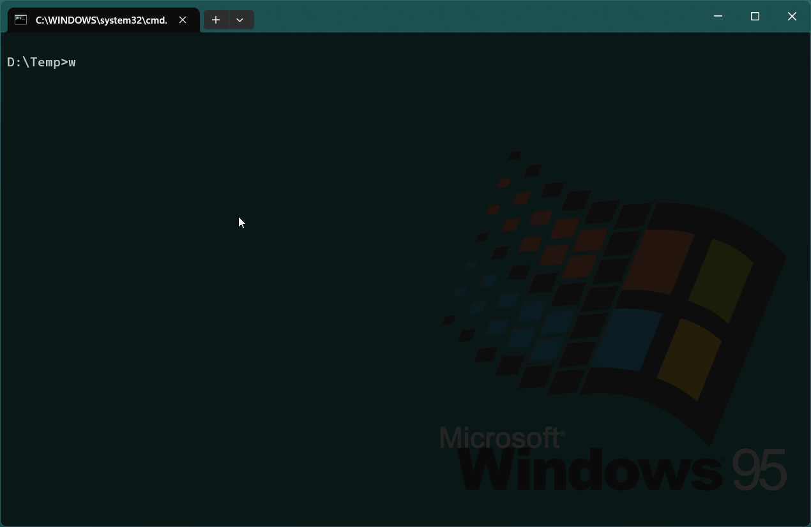

# wxapkg

> **免责声明**：此工具仅限于学习和研究软件内含的设计思想和原理，用户承担因使用此工具而导致的所有法律和相关责任！作者不承担任何法律责任！

**🎨 用法**



- 微信小程序扫描 + 解密 + 解包
  > 不指定参数的话，会在默认安装目录扫描小程序 wxid，然后获取小程序信息（需要网络）

  键盘上下键选中想要处理的小程序，然后按回车

    ```bash
    wxapkg.exe scan
    ```

- 单独解密 + 解包指定的微信小程序
  > 指定小程序路径，自动获取 wxid 然后解密解包
    ```bash     
    wxapkg.exe unpack -o out-dir -r "%USERPROFILE%\Documents\WeChat Files\Applet\wx00000000000000"
    ```

**⚒️ 安装**

下载最新的发布版本 [release](https://github.com/wux1an/wxapkg/releases/latest)，或者用下面的命令自己编译

```
go install github.com/wux1an/wxapkg@latest
```

**📝 其他功能**

- [x] 获取小程序信息（需要网络连接）
- [x] 代码美化，默认开启，可以使用 `--disable-beautify` 参数禁用
    - [x] 美化 `JSON` 文件
    - [x] 美化 `JavaScript` 文件（会有点慢）
    - [x] 美化 `Html` 文件，包括其中的 `<script>` 标签（会有点慢）
- [ ] 自动导出文件中的敏感 url 和 key 等信息

**🔗 参考**

- 小程序解密: https://github.com/BlackTrace/pc_wxapkg_decrypt
- 小程序解包: [https://gist.github.com/Integ/bcac5c21de5ea3...](https://gist.github.com/Integ/bcac5c21de5ea35b63b3db2c725f07ad)
- 原理介绍: [https://misakikata.github.io/2021/03/%E5%BE%...](https://misakikata.github.io/2021/03/%E5%BE%AE%E4%BF%A1%E5%B0%8F%E7%A8%8B%E5%BA%8F%E8%A7%A3%E5%8C%85/)
- 终端 ui 库: https://github.com/charmbracelet/bubbletea